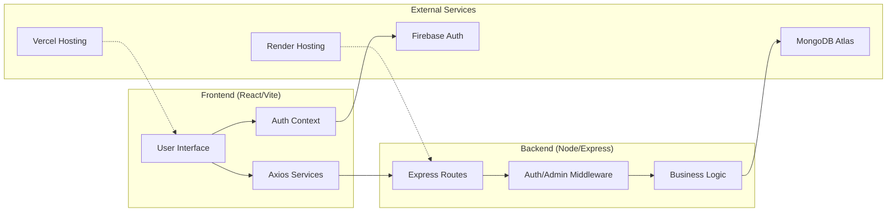
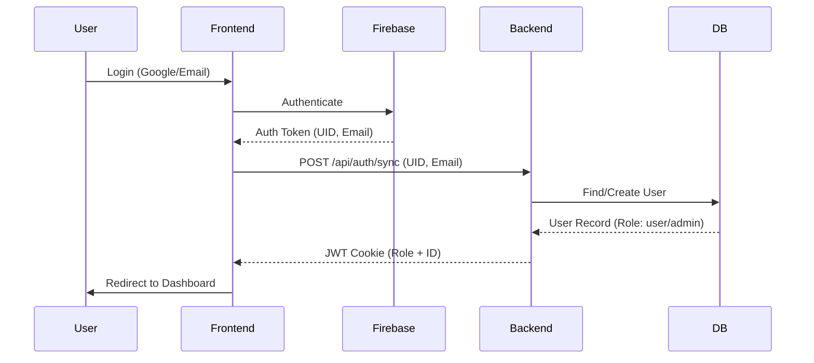
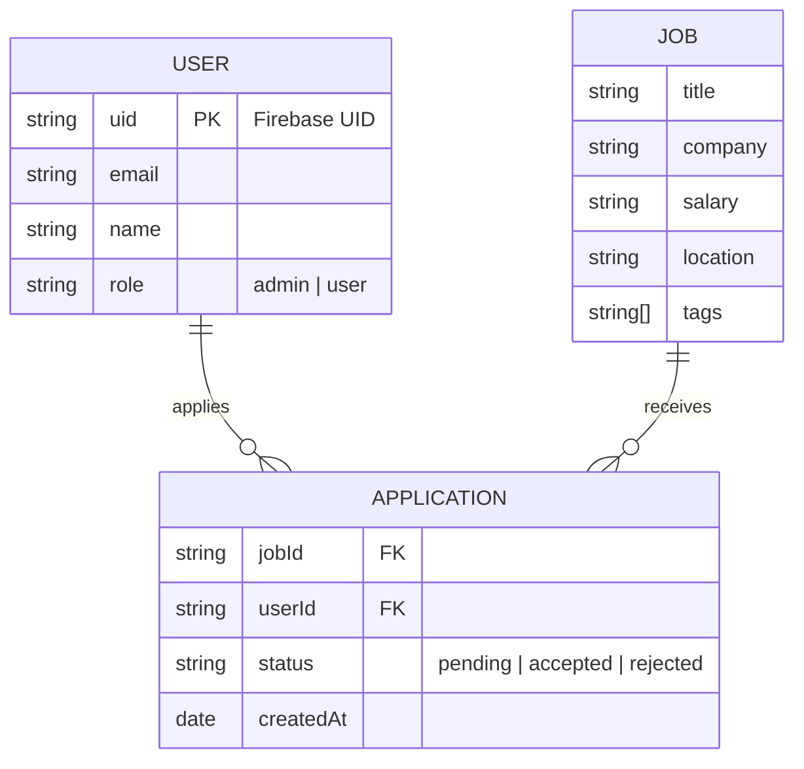
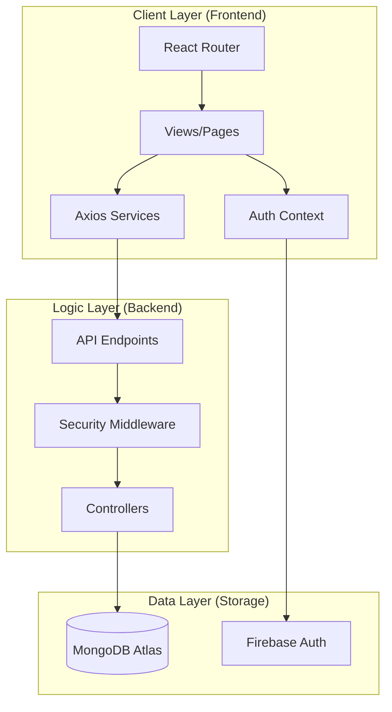

# QuickHire Project Report

## Executive Summary
**QuickHire** is a modern, full-stack job board platform designed to bridge the gap between employers and job seekers. The application features a sleek, responsive UI with real-time analytics, secure role-based authentication, and a robust backend management system.

---

## 🏗️ System Architecture

The application follows a decoupled **MERN-like** architecture (using Node/Express instead of a full MERN stack for some parts) with a dedicated frontend and backend.

### High-Level Architecture


---

## 🛠️ Technical Stack

### Frontend
- **Framework:** React 18 (Vite)
- **Styling:** Tailwind CSS + DaisyUI
- **Icons:** Lucide React + FontAwesome
- **Animations:** Framer Motion
- **State Management:** React Context API (Auth)
- **Authentication:** Firebase (Google OAuth & Email/Password)
- **Notifications:** React-Toastify + SweetAlert2
- **Data Visualization:** Chart.js + React-Chartjs-2

### Backend
- **Environment:** Node.js + Express.js
- **Database:** MongoDB Atlas (Mongoose ODM)
- **Security:** JSON Web Tokens (JWT) + Cookie-parser
- **CORS:** Configuration for cross-origin resource sharing

---

## 🔐 Authentication & Security Flow

The system employs a multi-layered authentication strategy.



### Key Security Features:
1. **JWT-protected Cookies:** Sessions are managed via secure cookies.
2. **Admin-only Routes:** Middleware verifies the 'admin' role before allowing job creation or deletion.
3. **Environment Isolation:** All sensitive keys (Firebase, MongoDB, JWT) are stored in `.env` files and never committed to version control.

---

## ✨ Key Features

### 1. Modern Job Discovery
- **Hero Section:** Animated headliner with Clash Display typography.
- **Search & Filter:** Functional search bar for job titles and locations.
- **Two-Column Listings:** Sleek, responsive grid for job cards.

### 2. Comprehensive Dashboards
- **Admin Dashboard:**
  - Real-time job statistics charts.
  - CRUD operations for job listings.
  - Applicant tracking.
- **User Dashboard:**
  - Personalized application tracking.
  - Profile management widgets.

### 3. Responsive Layout System
- **AppLayout:** Standard navbar/footer for public views.
- **AuthLayout:** Split-screen design using professional imagery for login/signup.
- **DashboardLayout:** Focused, sidebar-driven navigation for internal tools.

---

## 📂 Project Structure

### Backend Structure
```text
backend/
├── controllers/          # Business logic for auth, jobs, and applications
├── middleware/           # Auth and Admin protection logic
├── models/               # Mongoose schemas (User, Job, Application)
├── routes/               # API endpoint definitions
├── server.js             # Entry point: Express server and DB connection
├── seeder.js             # Script to populate initial job data
└── .env                  # Environment secrets (ignored by git)
```

### Frontend Structure
```text
frontend/
├── src/
│   ├── assets/           # Images, logos, and static visuals
│   ├── components/       # Reusable UI parts (Navbar, Footer, Modals)
│   ├── context/          # Auth context for global state management
│   ├── layouts/          # Tiered page structures (App, Auth, Dashboard)
│   ├── pages/            # Main screen components (Home, Dashboards, etc.)
│   ├── services/         # Axios API service configurations
│   ├── utils/            # Helper functions and dummy data
│   ├── App.jsx           # Main provider wrapper
│   └── router.jsx        # Navigation map and route protection
├── public/               # Public assets like favicon and banner
└── vercel.json           # Deployment configuration for Vercel
```

---

## 📊 Database Design (ERD)

The system manages three primary entities with the following relationships:



---

## 🏗️ Software Component Diagram

Detailed look at how the layers interact:



---

## ✨ Project Visuals


*Figure 1: High-fidelity Homepage Design*


*Figure 2: Admin Dashboard - Job Management & Analytics*


*Figure 3: User Dashboard - Application Tracking & Profiles*

---

## 🚀 How to Run the Project

### Prerequisites
- Node.js installed
- MongoDB Atlas account
- Firebase Project setup

### 1. Setup Backend
1. Navigate to directory: `cd backend`
2. Install dependencies: `npm install`
3. Configure `.env` with `MONGO_URI` and `JWT_SECRET`.
4. Start server: `npm run dev`

### 2. Setup Frontend
1. Navigate to directory: `cd frontend`
2. Install dependencies: `npm install`
3. Configure `.env` with Firebase keys (VITE_X).
4. Start dev server: `npm run dev`

---

> [!NOTE]
> This project was developed with a focus on visual excellence and performance, utilizing modern CSS techniques like Glassmorphism and hardware-accelerated animations.
